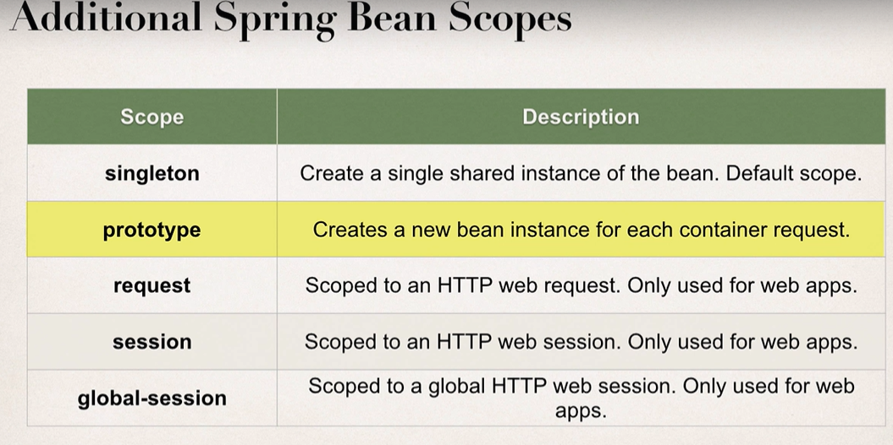
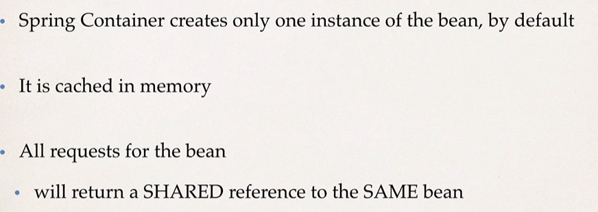
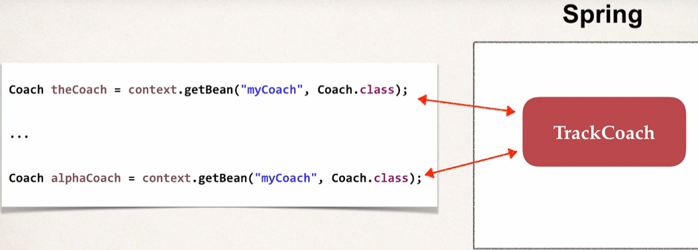
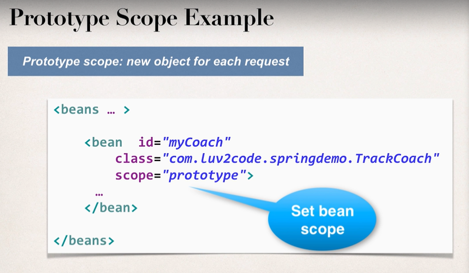
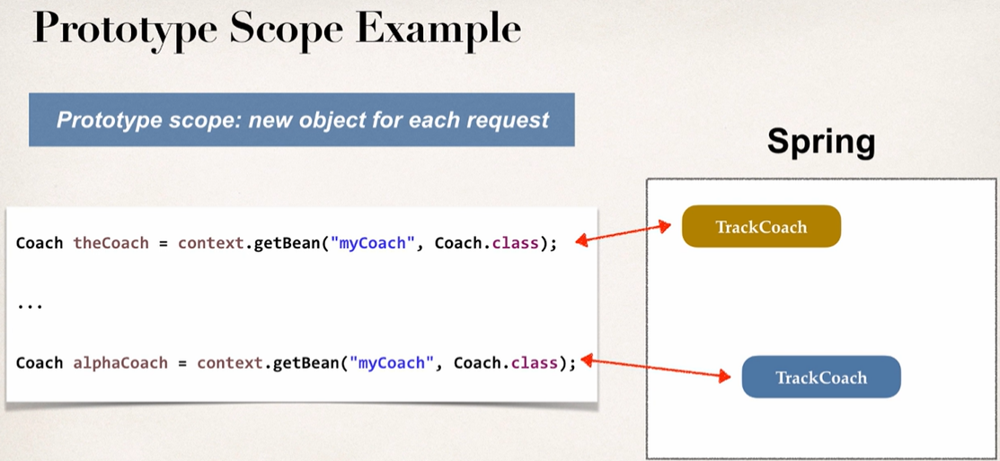
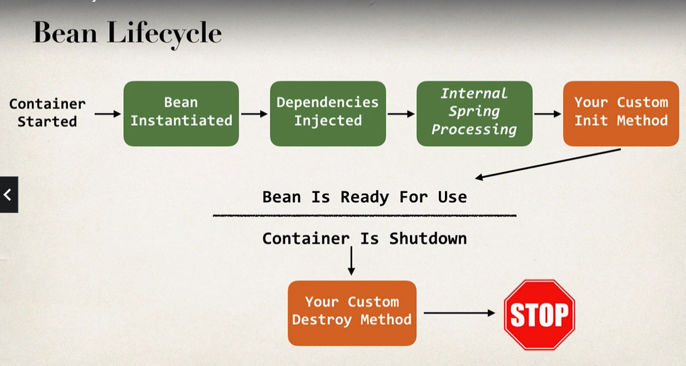

**Bean Scopes**
- scope refers to the lifecycle of a bean
- how long does the bean live?
- how many instances are created?
- how is the bean shared?

- Deafault scope is singleton.

  

**Singleton Scope**

**Prototype scopes:**

**Bean Lifecycle**

**Defining init and destroy methods - Method Signatures**

Special Note about init and destroy Method Signatures
  When using XML configuration, I want to provide additional details regarding the method signatures of the init-method  and destroy-method .

_Access modifier_
  The method can have any access modifier (public, protected, private)

Return type
  The method can have any return type. However, "void' is most commonly used. If you give a return type just note that you will not be able to capture the return value. As a result, "void" is commonly used.

Method name
  The method can have any method name.

Arguments
The method can not accept any arguments. The method should be no-arg.

**Note:**
- For "prototype" scoped beans, Spring does not call the destroy method. 