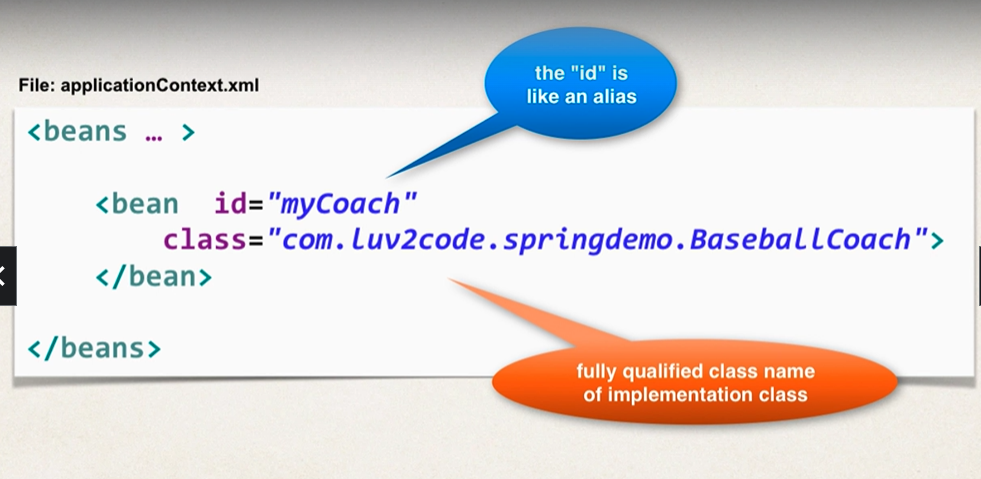
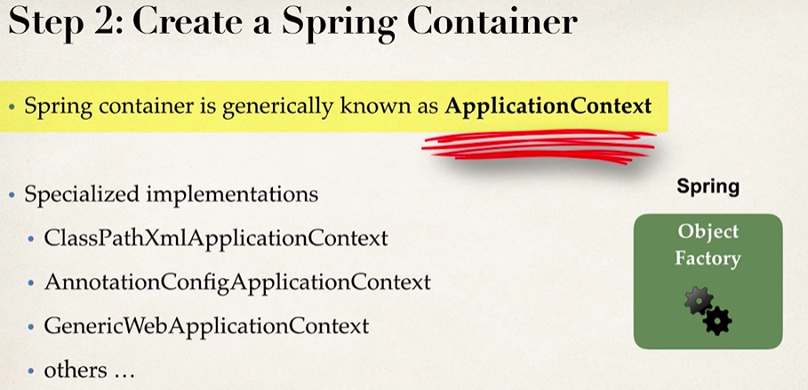
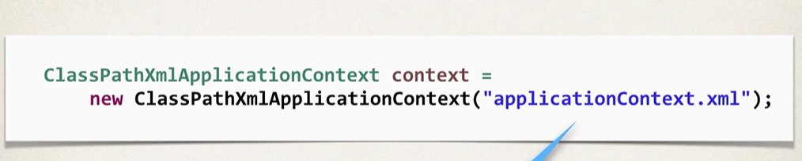
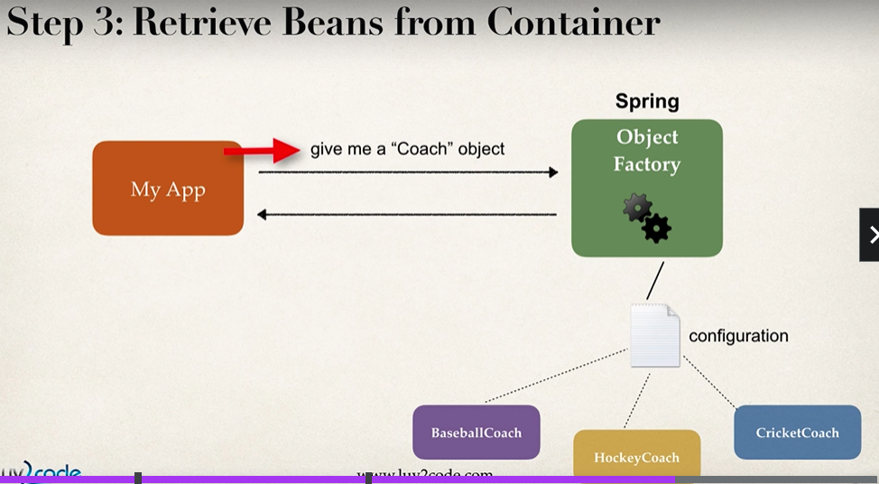
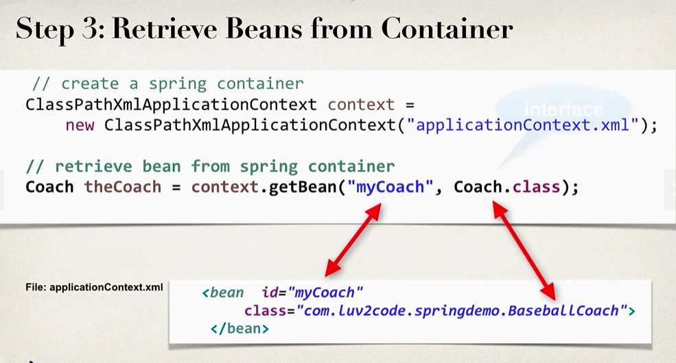
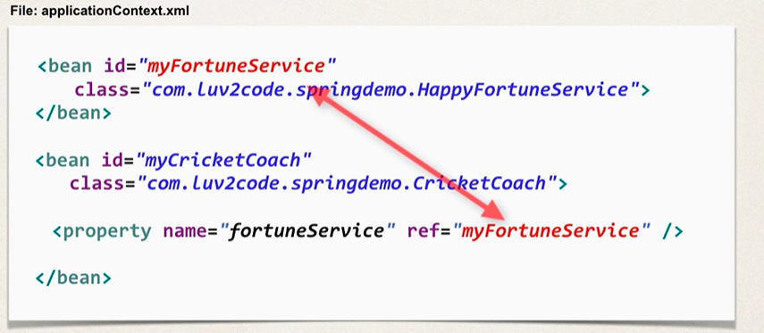
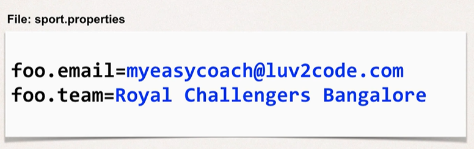
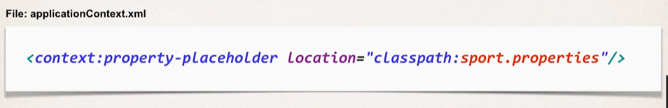
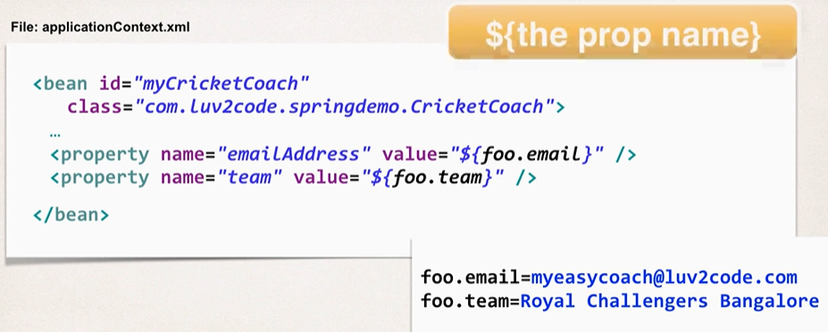

**What is a Spring Bean?**
   
     A "Spring Bean" is simply a Java object.
When Java objects are created by the Spring Container, then Spring refers to them as "Spring Beans".
Spring Beans are created from normal Java classes .... just like Java objects.

Source: https://docs.spring.io/spring/docs/current/spring-framework-reference/core.html#beans-introduction

**Configuring Spring Container**
    
Spring configuration can be done with 3 ways:
- XML configuration file(legacy)
- Java annotations(modern)
- java source code(modern)

**Spring Development Process**
1. Configure your Spring Beans
2. Create a Spring Container(ApplicationContext)
3. ReTrieve Beans from Spring Container

Step 1:
    

Step 2:
    
    

Step 3:
    
    

**Dependency Injection**
1. Constructor Injection
2. Setter Injection

**Constructor Injection**

Steps:
- Define the dependency interface and class
- create a constructor in your class for injections
- configure the depnedency injection in spring config file

**Setter Injection**

Steps:
- Create setter method(s) in your class for injections
- Configure the dependency injection in spring config file

    

**Injecting values from property file**

Steps:
- Create Properties File
- Load Properties File in Spring config file
- Reference values from Properties file
 

