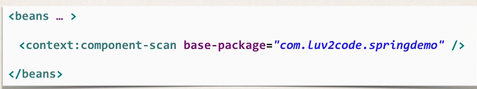
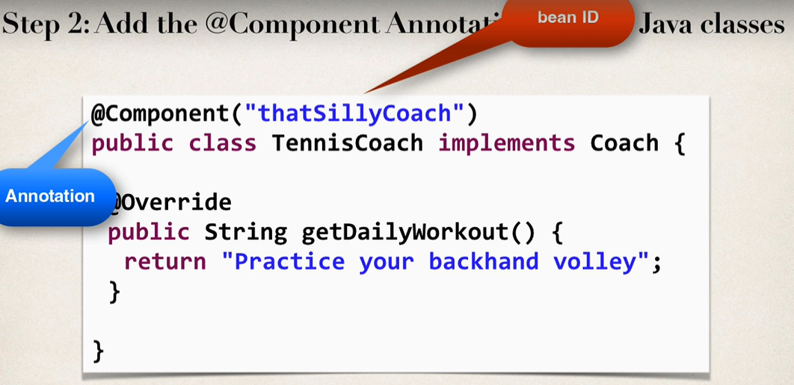
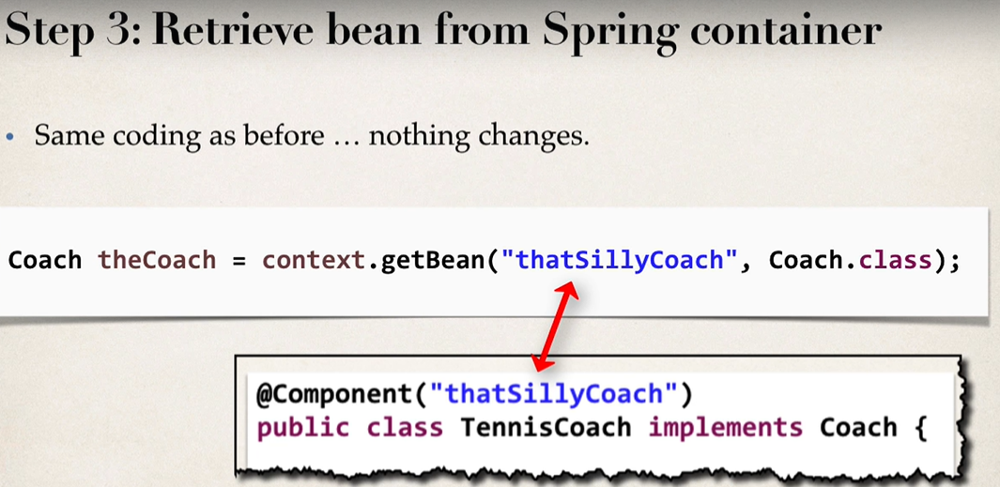
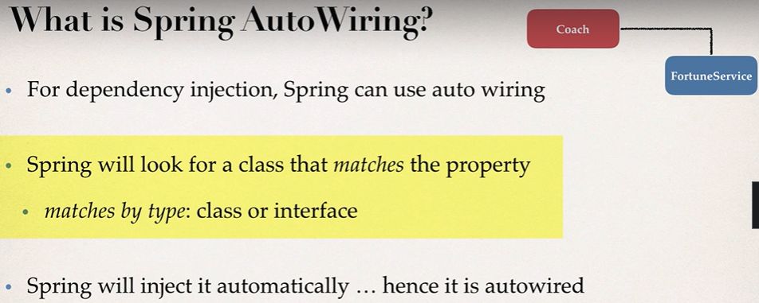

#  **Annotation based configuration** ########

**Component Scanning**
- Enable component scanning in Spring config file
- Add the @Component Annotation to your Java Classes
- retrieve bean from spring container

- Spring also supports Defaukt Bean IDs
- Default bean id : the class name, make first letter lower-case
    - e.g Class Name is **TennisCoach**  then Default bean Id is **tennisCoach**

**Spring Auto Wiring**
    

**Constructor Injection - Autowired Optional?**
- As of Spring Framework 4.3, an @Autowired annotation on such a constructor is no longer necessary if the target bean only defines one constructor to begin with. 
- However, if several constructors are available, at least one must be annotated to teach the container which one to use.
- https://docs.spring.io/spring/docs/current/spring-framework-reference/core.html#beans-autowired-annotation
- https://docs.spring.io/spring-framework/docs/current/reference/html/core.html#beans-autowired-annotation

**Note:**

## **Default Bean Names - The Special Case**

In general, when using Annotations, for the default bean name, Spring uses the following rule.
If the annotation's value doesn't indicate a bean name, an appropriate name will be built based on the short name of the class (with the first letter lower-cased).

For example:
HappyFortuneService --> happyFortuneService

However, for the special case of when BOTH the first and second characters of the class name are upper case, then the name is NOT converted.

For the case of RESTFortuneService
RESTFortuneService --> RESTFortuneService

No conversion since the first two characters are upper case.
Behind the scenes, Spring uses the Java Beans Introspector to generate the default bean name. Here's a screenshot of the documentation for the key method.

Also, here's a link to the documentation.
- https://docs.oracle.com/javase/8/docs/api/java/beans/Introspector.html#decapitalize(java.lang.String)

As always, you can specify a name for your bean.

@Component("foo")
public class RESTFortuneService .... {
}

**@Qualifier annotation**

- for Constructor, it has to be added with parameter 
e.g
  @Autowired
  public TennisCoach(@Qualifier("randomFortuneService") FortuneService theFortuneService) {

- with Setter Injection, 
- You can use @Qualifier in method arguments line, such as
	@Autowired
	public void setFortuneService(@Qualifier("randomFortuneService") FortuneService theFortuneService) {
		System.out.println(">> TennisCoach: inside setFortuneService() method");
		this.fortuneService = theFortuneService;
	}

- You can also use the @Qualifier above the method name. For example, here's the syntax

	@Autowired
	@Qualifier("randomFortuneService")
	public void setFortuneService(FortuneService theFortuneService) {
		System.out.println(">> TennisCoach: inside setFortuneService() method");
		this.fortuneService = theFortuneService;
	}
